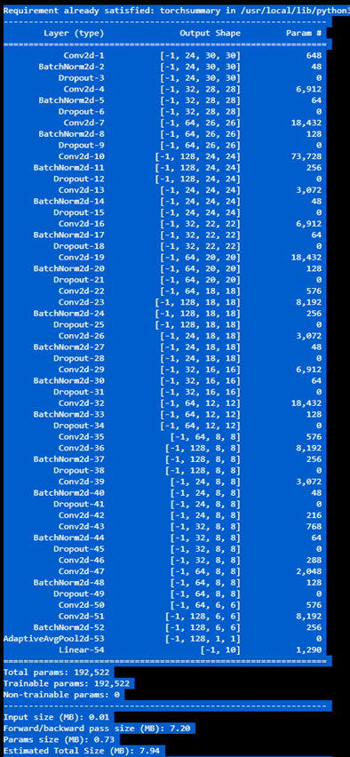
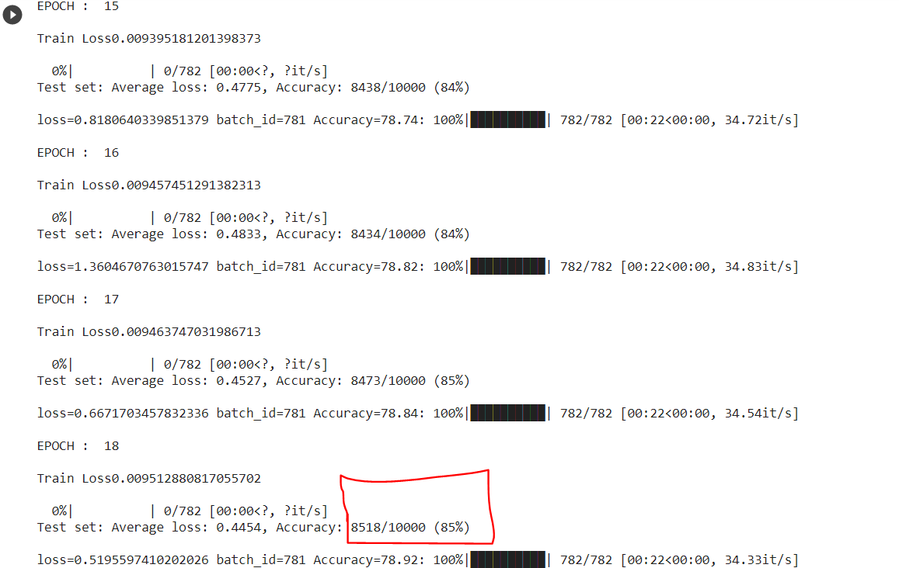

# EVA6_Session7

## Problem Statement :- 

### Create a model for CIFAR-10 with 4 Layers C1C2C3C40 and less than 200k parameters and achieve accuracy of 85%+ using GPU.

## Solution
1. Created a Model with 192,522 parameters 
2. Architecture : - 24-->32-->64-->128 in ALL 4 Layers
3. Using GAP and FC layer at end.
4. RF - 44
5. <b>Oversampling of Underperforming classes</b> - Checking for classes that are underperforming and training them more than other classes
6. Output - 85.1% Accuracy

## Model Summary

## Log with 85%+ Accuracy

